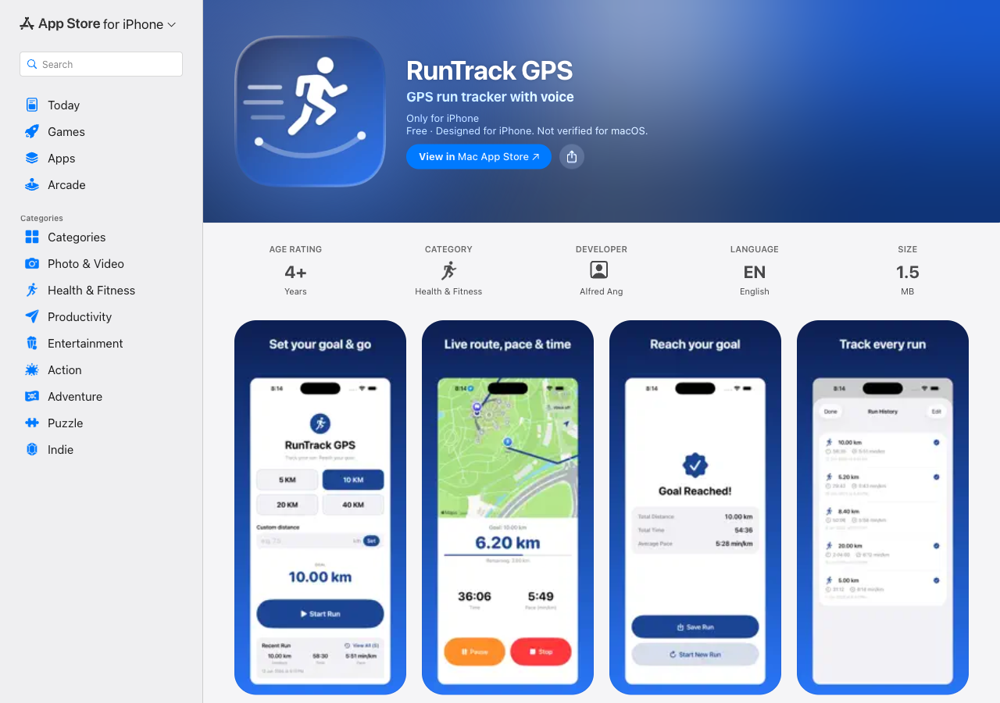
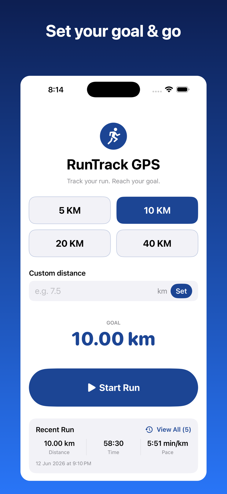
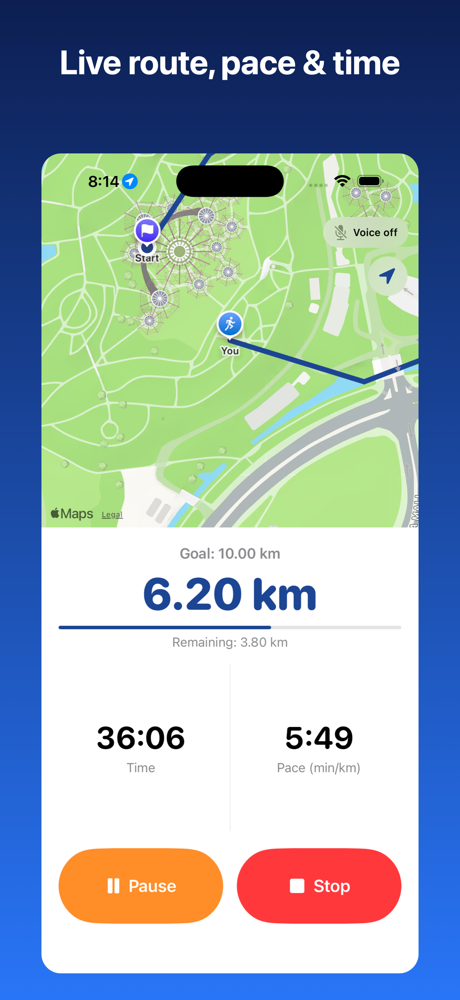
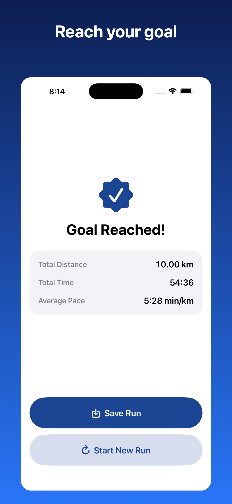
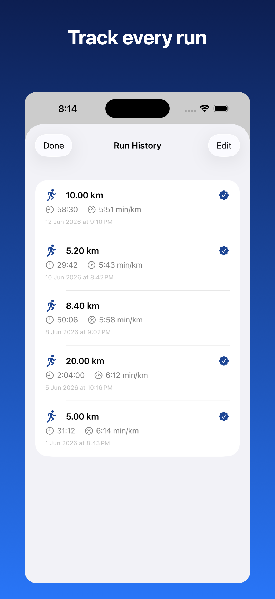

<div align="center">

# 🏃 RunTrack GPS

[](https://www.apple.com/ios/)
[](https://swift.org)
[](https://developer.apple.com/xcode/swiftui/)
[](https://developer.apple.com/maps/)
[](#license)
[](https://apps.apple.com/us/app/runtrack-gps/id6779956150)

**A clean, lightweight native iOS running app — track your run by GPS, watch your route draw live, and reach your distance goal with voice feedback.**

📲 **Now live on the App Store — [Download RunTrack GPS](https://apps.apple.com/us/app/runtrack-gps/id6779956150)**

[](https://apps.apple.com/us/app/runtrack-gps/id6779956150)

</div>

## Screenshots

| Home | Live Run | Goal Reached | History |
|------|----------|--------------|---------|
|  |  |  |  |

## About

RunTrack GPS is a focused outdoor running tracker built entirely with **Swift + SwiftUI** and an **MVVM** architecture. Pick a preset or custom distance goal, start running, and the app tracks your distance, pace, and time in real time while drawing your route on a live map — even with the screen locked.

### Key Features

- 🎯 **Goals** — preset 5 / 10 / 20 / 40 km, or a custom distance
- 🛰️ **Real-time GPS tracking** with noise filtering (rejects poor accuracy, jitter, and unrealistic jumps)
- 🗺️ **Live route map** (MapKit) with start/current markers and follow-me camera
- ⏱️ **Distance, pace & time** updating live, with a big glanceable readout
- 🗣️ **Voice commands** — "start / pause / resume / stop" (Speech framework)
- 🔊 **Voice feedback** — spoken milestones at each km, halfway, 90%, and goal
- 🌙 **Background tracking** — GPS, timer, and audio keep running when the screen is locked
- 📊 **On-device history** — every run saved locally (distance, time, pace, date)
- 🎨 Native dark-mode support, large typography, large touch targets

## Tech Stack

| Layer | Technology |
|-------|-----------|
| Language | Swift 5 |
| UI | SwiftUI (iOS 16+) |
| Architecture | MVVM (single coordinating view model) |
| Location | CoreLocation (background updates, GPS filtering) |
| Maps | MapKit (`MKMapView` via `UIViewRepresentable`) |
| Voice input | Speech framework (`SFSpeechRecognizer`) |
| Voice output | AVFoundation (`AVSpeechSynthesizer`) |
| Persistence | `UserDefaults` (local, on-device) |
| Project gen | [XcodeGen](https://github.com/yonyz/XcodeGen) (`project.yml`) |

## Architecture

```
┌──────────────────────────── SwiftUI Views ────────────────────────────┐
│   HomeView      RunView      CompletionView      HistoryView           │
└───────────────────────────────┬────────────────────────────────────────┘
                                 │ observes (@Published)
                       ┌─────────▼──────────┐
                       │    RunViewModel     │   ← MVVM coordinator
                       │  (state + actions)  │
                       └───┬───┬───┬───┬─────┘
            ┌──────────────┘   │   │   └──────────────┐
   ┌────────▼───────┐ ┌────────▼──┐ ┌▼───────────────┐ ┌▼──────────────┐
   │ LocationManager│ │RunTimer   │ │VoiceCommand    │ │SpeechFeedback │
   │ CoreLocation   │ │Manager    │ │Manager (Speech)│ │ (AVSpeech)    │
   │ + GPS filtering│ │wall-clock │ │recognition     │ │ de-duplicated │
   └───────┬────────┘ └───────────┘ └────────────────┘ └───────────────┘
           │ route + distance
   ┌───────▼────────┐        ┌────────────────┐
   │  RouteMapView  │        │   RunStore      │
   │  (MapKit)      │        │ UserDefaults    │
   └────────────────┘        └────────────────┘
```

`RunViewModel` is the single source of truth: it owns the four managers, subscribes to the
location stream via Combine, recomputes pace, fires de-duplicated milestone announcements,
detects goal completion, and drives navigation. Views are thin and observe only the view model.

## Project Structure

```
runningapp/
└── RunTrackGPS/
    ├── project.yml                 # XcodeGen project definition
    ├── RunTrackGPS/
    │   ├── App/                    # @main entry point
    │   ├── Models/                 # RunSession, AppScreen
    │   ├── ViewModels/             # RunViewModel (coordinator)
    │   ├── Views/                  # Home, Run, Completion, History, Root
    │   ├── Managers/               # Location, Timer, VoiceCommand, SpeechFeedback
    │   ├── Maps/                   # RouteMapView (MapKit)
    │   ├── Utilities/              # PaceCalculator, RunStore
    │   ├── Resources/              # Assets (icon, accent color)
    │   └── Support/                # Info.plist, PrivacyInfo.xcprivacy
    └── scripts/                    # icon + screenshot generators
```

## Getting Started

### Prerequisites

- macOS with **Xcode 15+**
- An iPhone running **iOS 16+** (GPS & Speech need a real device, not the Simulator)
- [XcodeGen](https://github.com/yonyz/XcodeGen): `brew install xcodegen`

### Build & Run

```bash
git clone https://github.com/alfredang/runningapp.git
cd runningapp/RunTrackGPS

# Generate the Xcode project from project.yml
xcodegen generate
open RunTrackGPS.xcodeproj
```

Then in Xcode:
1. Select the **RunTrackGPS** target → **Signing & Capabilities** → choose your **Team**.
2. Plug in your iPhone, select it as the destination, and press **⌘R**.
3. Grant **Location (Always)**, **Microphone**, and **Speech Recognition** when prompted.

> The `.xcodeproj` is generated by XcodeGen and is gitignored — edit `project.yml`, not the project.

## Permissions & Background

The app requests Location (Always, for background tracking), Microphone, and Speech Recognition.
Background modes `location` and `audio` are enabled so GPS, the timer, and spoken feedback continue
when the screen is locked. All run data stays **on the device** — nothing is uploaded.

## Contributing

1. Fork the repo
2. Create a feature branch (`git checkout -b feature/amazing`)
3. Commit your changes
4. Open a Pull Request

## License

Released under the MIT License.

## Developed By

**Tertiary Infotech Academy Pte. Ltd.**

## Acknowledgements

- Apple — SwiftUI, CoreLocation, MapKit, AVFoundation, Speech
- [XcodeGen](https://github.com/yonyz/XcodeGen) for reproducible project generation

---

<div align="center">

⭐ If you find this useful, give it a star!

</div>
